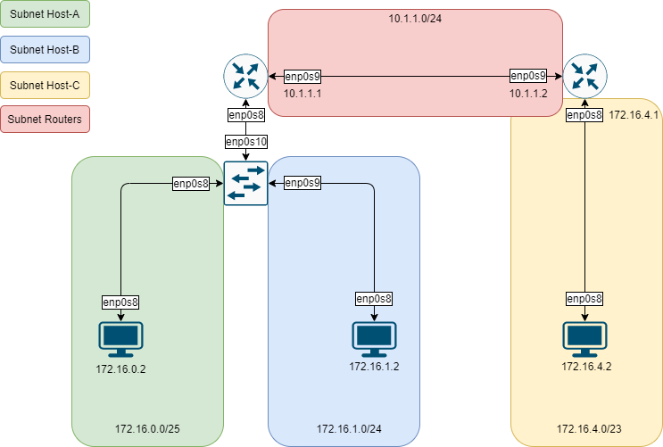

# DNCS-LAB

This repository contains the Vagrant files required to run the virtual lab environment used in the DNCS course.
```


        +-----------------------------------------------------+
        |                                                     |
        |                                                     |eth0
        +--+--+                +------------+             +------------+
        |     |                |            |             |            |
        |     |            eth0|            |eth2     eth2|            |
        |     +----------------+  router-1  +-------------+  router-2  |
        |     |                |            |             |            |
        |     |                |            |             |            |
        |  M  |                +------------+             +------------+
        |  A  |                      |eth1                       |eth1
        |  N  |                      |                           |
        |  A  |                      |                           |
        |  G  |                      |                     +-----+----+
        |  E  |                      |eth1                 |          |
        |  M  |            +-------------------+           |          |
        |  E  |        eth0|                   |           |  host-c  |
        |  N  +------------+      SWITCH       |           |          |
        |  T  |            |                   |           |          |
        |     |            +-------------------+           +----------+
        |  V  |               |eth2         |eth3                |eth0
        |  A  |               |             |                    |
        |  G  |               |             |                    |
        |  R  |               |eth1         |eth1                |
        |  A  |        +----------+     +----------+             |
        |  N  |        |          |     |          |             |
        |  T  |    eth0|          |     |          |             |
        |     +--------+  host-a  |     |  host-b  |             |
        |     |        |          |     |          |             |
        |     |        |          |     |          |             |
        ++-+--+        +----------+     +----------+             |
        | |                              |eth0                   |
        | |                              |                       |
        | +------------------------------+                       |
        |                                                        |
        |                                                        |
        +--------------------------------------------------------+


```

# Requirements
 - Python 3
 - 10GB disk storage
 - 2GB free RAM
 - Virtualbox
 - Vagrant (https://www.vagrantup.com)
 - Internet

# How-to
 - Install Virtualbox and Vagrant
 - Clone this repository
`git clone https://github.com/fabrizio-granelli/dncs-lab`
 - You should be able to launch the lab from within the cloned repo folder.
```
cd dncs-lab
[~/dncs-lab] vagrant up
```
Once you launch the vagrant script, it may take a while for the entire topology to become available.
 - Verify the status of the 4 VMs
 ```
 [dncs-lab]$ vagrant status                                                                                                                                                                
Current machine states:

router                    running (virtualbox)
switch                    running (virtualbox)
host-a                    running (virtualbox)
host-b                    running (virtualbox)
```
- Once all the VMs are running verify you can log into all of them:
`vagrant ssh router`
`vagrant ssh switch`
`vagrant ssh host-a`
`vagrant ssh host-b`
`vagrant ssh host-c`

# Assignment
This section describes the assignment, its requirements and the tasks the student has to complete.
The assignment consists in a simple piece of design work that students have to carry out to satisfy the requirements described below.
The assignment deliverable consists of a Github repository containing:
- the code necessary for the infrastructure to be replicated and instantiated
- an updated README.md file where design decisions and experimental results are illustrated
- an updated answers.yml file containing the details of your project

## Design Requirements
- Hosts 1-a and 1-b are in two subnets (*Hosts-A* and *Hosts-B*) that must be able to scale up to respectively 119 and 195 usable addresses
- Host 2-c is in a subnet (*Hub*) that needs to accommodate up to 412 usable addresses
- Host 2-c must run a docker image (dustnic82/nginx-test) which implements a web-server that must be reachable from Host-1-a and Host-1-b
- No dynamic routing can be used
- Routes must be as generic as possible
- The lab setup must be portable and executed just by launching the `vagrant up` command

## Tasks
- Fork the Github repository: https://github.com/fabrizio-granelli/dncs-lab
- Clone the repository
- Run the initiator script (dncs-init). The script generates a custom `answers.yml` file and updates the Readme.md file with specific details automatically generated by the script itself.
  This can be done just once in case the work is being carried out by a group of (<=2) engineers, using the name of the 'squad lead'. 
- Implement the design by integrating the necessary commands into the VM startup scripts (create more if necessary)
- Modify the Vagrantfile (if necessary)
- Document the design by expanding this readme file
- Fill the `answers.yml` file where required (make sure that is committed and pushed to your repository)
- Commit the changes and push to your own repository
- Notify the examiner (fabrizio.granelli@unitn.it) that work is complete specifying the Github repository, First Name, Last Name and Matriculation number. This needs to happen at least 7 days prior an exam registration date.

# Notes and References
- https://rogerdudler.github.io/git-guide/
- http://therandomsecurityguy.com/openvswitch-cheat-sheet/
- https://www.cyberciti.biz/faq/howto-linux-configuring-default-route-with-ipcommand/
- https://www.vagrantup.com/intro/getting-started/


# Design

## Address space
As show in the previous table the subnetting was performed by choosing the smallest netmask range that could satisfy the requirement. This design is based on the principle of not allocating an excessive number of addresses. In addition to the subnets of the requirements, an additional subnet was included in the network design: the two routers have their own subnet. This choice was made in order to have a distinct address space for the router.

## Subnet table

| Subnet name    | Network address/Netmask | Subnet mask     | Beginning address | Ending address | Number of available addresses | Requirement for the available addresses |
|----------------|-------------------------|-----------------|-------------------|----------------|-------------------------------|-----------------------------------------|
| Host-a subnet  | 172.16.0.0/25           | 255.255.255.128 | 172.16.0.1        | 172.16.0.126   | 126                           | 119                                     |
| Host-b subnet  | 172.16.1.0/24           | 255.255.255.0   | 172.16.1.1        | 172.16.1.254   | 254                           | 195                                     |
| Host-c subnet  | 172.16.4.0/23           | 255.255.254.0   | 172.16.4.1        | 172.16.5.254   | 510                           | 412                                     |
| Routers subnet | 10.1.1.0/24             | 255.255.255.0   | 10.1.1.1          | 10.1.1.254     | 254                           | N/A                                     |
<br>
Note:

  - The beginning address does not take on account the network address as it is not usable;
  - The ending address does not take on account the broadcast address as it is not usable.

## Network design diagram



# Configuration

## Host configuration
Network configuration of each host was performed by importing a yaml configuration file written in netplan syntax. The entire network has been configured as shown in the design phase. 

## Routing configuration
For each host, static routing rules have been configured in order to enable connection between subnets.
### Host A
| Network Destination | Gateway    | Netmask       | Interface |
|---------------------|------------|---------------|-----------|
| 172.16.0.0          | 172.16.0.1 | 255.255.248.0 | enp0s8    |
| 10.1.1.0            | 172.16.0.1 | 255.255.255.0 | enp0s8    |

### Host B
| Network Destination | Gateway    | Netmask       | Interface |
|---------------------|------------|---------------|-----------|
| 172.16.0.0          | 172.16.1.1 | 255.255.248.0 | enp0s8    |
| 10.1.1.0            | 172.16.1.1 | 255.255.255.0 | enp0s8    |

### Host C
| Network Destination | Gateway    | Netmask       | Interface |
|---------------------|------------|---------------|-----------|
| 172.16.0.0          | 172.16.0.1 | 255.255.248.0 | enp0s8    |
| 10.1.1.0            | 172.16.0.1 | 255.255.255.0 | enp0s8    |

### Router-1
| Network Destination | Gateway    | Netmask       | Interface |
|---------------------|------------|---------------|-----------|
| 172.16.4.0          | 10.1.1.2   | 255.255.255.0 | enp0s9    |

### Router-2
| Network Destination | Gateway    | Netmask       | Interface |
|---------------------|------------|---------------|-----------|
| 172.16.0.0          | 10.1.1.1   | 255.255.252.0 | enp0s9    |

## Switch configuration
As stated in the requirements of the assignment, the switch must be configured by using openswitch functionalities. In this case a bridge called "switch" is created. To this switch three interfaces are attached:

  - enp0s8 where router-1 is attached;
  - enp0s9 where host-a is attached;
  - enp0s10 where host-b is attached.

More precisly, in order to be able to route correctly the packets, two vlans are configured in router-1 and so in the switch:
  - ID: 2 for the network 172.16.0.0/25
  - ID: 3 for the network 172.16.1.0/24

## Docker website container configuration
As requested by the assignment requirments, a docker container must be executed in the host-c. In the provisioning script file of the host-c (docker_container.sh) there are all the instructions in order to correctly configure a website available on port 80. 
For this reason the website can be reached by launching the following command: "curl 172.16.4.2 80".


